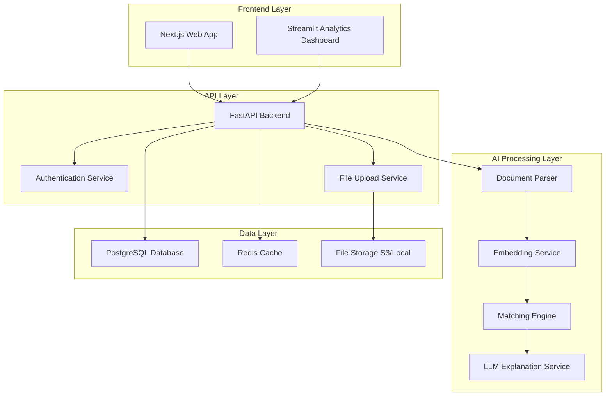

# Design Document

## Overview

The Resume & Job Matching AI system is a scalable web application that leverages natural language processing and machine learning to automate candidate-job compatibility analysis. The system uses semantic embeddings for similarity scoring, LLM-powered explanations, and provides both recruiter and job seeker interfaces with comprehensive analytics.

## Architecture

### High-Level Architecture



### Technology Stack

- **Frontend**: Next.js 14 with TypeScript for main application, Streamlit for analytics dashboard
- **Backend**: FastAPI with Python 3.11+
- **Database**: PostgreSQL 15+ with proper indexing
- **Cache**: Redis for session management and temporary data
- **AI Models**: 
  - Sentence Transformers (all-MiniLM-L6-v2) for embeddings
  - OpenAI GPT-4 for explanations
  - spaCy for skill extraction
- **File Storage**: Local filesystem or AWS S3
- **Deployment**: Docker containers with Docker Compose

## Components and Interfaces

### 1. Document Processing Service

**Purpose**: Extract and normalize text from uploaded documents

**Key Components**:
- `DocumentParser`: Handles PDF/DOCX text extraction
- `TextNormalizer`: Cleans and standardizes text content
- `SectionExtractor`: Identifies resume sections (Experience, Skills, Education)

**Interfaces**:
```python
class DocumentProcessor:
    async def extract_text(self, file_path: str, file_type: str) -> str
    async def normalize_text(self, raw_text: str) -> str
    async def extract_sections(self, text: str) -> Dict[str, str]
```

### 2. Embedding Service

**Purpose**: Generate semantic embeddings for job descriptions and resumes

**Key Components**:
- `EmbeddingGenerator`: Creates vector representations using Sentence Transformers
- `EmbeddingCache`: Caches embeddings to avoid recomputation

**Interfaces**:
```python
class EmbeddingService:
    async def generate_embedding(self, text: str) -> List[float]
    async def batch_generate_embeddings(self, texts: List[str]) -> List[List[float]]
    async def get_cached_embedding(self, text_hash: str) -> Optional[List[float]]
```

### 3. Matching Engine

**Purpose**: Calculate similarity scores and rank candidates

**Key Components**:
- `SimilarityCalculator`: Computes cosine similarity between embeddings
- `SkillExtractor`: Identifies and compares skills using NLP
- `RankingService`: Orders candidates by match scores

**Interfaces**:
```python
class MatchingEngine:
    async def calculate_match_score(self, job_embedding: List[float], resume_embedding: List[float]) -> float
    async def extract_skills(self, text: str) -> List[str]
    async def compare_skills(self, job_skills: List[str], resume_skills: List[str]) -> Dict[str, List[str]]
    async def rank_candidates(self, matches: List[CandidateMatch]) -> List[CandidateMatch]
```

### 4. Explanation Service

**Purpose**: Generate human-readable explanations for match scores

**Key Components**:
- `LLMExplainer`: Uses GPT-4 to create detailed explanations
- `TemplateEngine`: Structures explanations consistently

**Interfaces**:
```python
class ExplanationService:
    async def generate_explanation(self, job_desc: str, resume: str, match_score: float, skill_analysis: Dict) -> str
    async def create_improvement_suggestions(self, missing_skills: List[str]) -> List[str]
```

### 5. Analytics Service

**Purpose**: Generate recruitment metrics and insights

**Key Components**:
- `MetricsCalculator`: Computes recruitment statistics
- `TrendAnalyzer`: Identifies patterns over time
- `ReportGenerator`: Creates exportable reports

**Interfaces**:
```python
class AnalyticsService:
    async def get_job_metrics(self, job_id: str) -> JobMetrics
    async def get_skill_gap_analysis(self, job_id: str) -> SkillGapReport
    async def generate_trend_report(self, date_range: DateRange) -> TrendReport
```

## Data Models

### Core Entities

```python
# Job Description Model
class JobDescription(BaseModel):
    id: UUID
    title: str
    company: str
    description: str
    requirements: str
    created_by: UUID
    created_at: datetime
    embedding: Optional[List[float]]

# Resume Model
class Resume(BaseModel):
    id: UUID
    candidate_name: str
    email: str
    phone: Optional[str]
    content: str
    sections: Dict[str, str]
    uploaded_at: datetime
    embedding: Optional[List[float]]

# Match Result Model
class MatchResult(BaseModel):
    id: UUID
    job_id: UUID
    resume_id: UUID
    match_score: float
    explanation: str
    key_strengths: List[str]
    missing_skills: List[str]
    created_at: datetime

# User Model
class User(BaseModel):
    id: UUID
    email: str
    role: UserRole  # RECRUITER, HIRING_MANAGER, JOB_SEEKER
    company_id: Optional[UUID]
    created_at: datetime
```

### Database Schema

```sql
-- Jobs table
CREATE TABLE jobs (
    id UUID PRIMARY KEY DEFAULT gen_random_uuid(),
    title VARCHAR(255) NOT NULL,
    company VARCHAR(255) NOT NULL,
    description TEXT NOT NULL,
    requirements TEXT NOT NULL,
    created_by UUID NOT NULL,
    created_at TIMESTAMP DEFAULT NOW(),
    embedding VECTOR(384)  -- Using pgvector extension
);

-- Resumes table
CREATE TABLE resumes (
    id UUID PRIMARY KEY DEFAULT gen_random_uuid(),
    candidate_name VARCHAR(255) NOT NULL,
    email VARCHAR(255),
    phone VARCHAR(50),
    content TEXT NOT NULL,
    sections JSONB,
    uploaded_at TIMESTAMP DEFAULT NOW(),
    embedding VECTOR(384)
);

-- Match results table
CREATE TABLE match_results (
    id UUID PRIMARY KEY DEFAULT gen_random_uuid(),
    job_id UUID REFERENCES jobs(id),
    resume_id UUID REFERENCES resumes(id),
    match_score DECIMAL(5,2) NOT NULL,
    explanation TEXT NOT NULL,
    key_strengths TEXT[],
    missing_skills TEXT[],
    created_at TIMESTAMP DEFAULT NOW()
);

-- Indexes for performance
CREATE INDEX idx_jobs_created_by ON jobs(created_by);
CREATE INDEX idx_match_results_job_id ON match_results(job_id);
CREATE INDEX idx_match_results_score ON match_results(match_score DESC);
CREATE INDEX idx_resumes_uploaded_at ON resumes(uploaded_at);
```

## Error Handling

### Error Categories

1. **File Processing Errors**
   - Invalid file format
   - Corrupted files
   - File size limits exceeded
   - Text extraction failures

2. **AI Processing Errors**
   - Embedding generation failures
   - LLM API rate limits
   - Model inference errors
   - Timeout errors

3. **Database Errors**
   - Connection failures
   - Query timeouts
   - Constraint violations
   - Data corruption

### Error Handling Strategy

```python
class ErrorHandler:
    async def handle_file_error(self, error: FileProcessingError) -> ErrorResponse
    async def handle_ai_error(self, error: AIProcessingError) -> ErrorResponse
    async def handle_db_error(self, error: DatabaseError) -> ErrorResponse
    
    async def retry_with_backoff(self, operation: Callable, max_retries: int = 3)
    async def log_error(self, error: Exception, context: Dict[str, Any])
```

### Graceful Degradation

- If embedding service fails, fall back to keyword-based matching
- If LLM explanation fails, provide template-based explanations
- If real-time processing fails, queue for batch processing
- Implement circuit breakers for external API calls

## Testing Strategy

### Unit Testing
- Test individual components in isolation
- Mock external dependencies (AI models, database)
- Focus on business logic and edge cases
- Target 80%+ code coverage

### Integration Testing
- Test API endpoints with real database
- Test file upload and processing workflows
- Test AI model integration
- Validate data consistency across services

### Performance Testing
- Load testing with 500+ concurrent resume uploads
- Stress testing embedding generation
- Database query performance under load
- Memory usage optimization

### End-to-End Testing
- Complete user workflows (recruiter and job seeker)
- Cross-browser compatibility testing
- Mobile responsiveness testing
- Analytics dashboard functionality

### Test Data Strategy
- Synthetic resume and job description datasets
- Anonymized real-world data for validation
- Edge cases (empty files, malformed documents)
- Performance benchmarking datasets

## Security Considerations

### Data Protection
- Encrypt sensitive data at rest and in transit
- Implement proper access controls and authentication
- Regular security audits and vulnerability assessments
- GDPR compliance for candidate data

### API Security
- Rate limiting to prevent abuse
- Input validation and sanitization
- JWT-based authentication
- CORS configuration for frontend access

### File Upload Security
- File type validation
- Virus scanning for uploaded files
- Size limits and storage quotas
- Secure file storage with access controls

## Performance Optimization

### Caching Strategy
- Cache embeddings to avoid recomputation
- Redis for session data and temporary results
- Database query result caching
- CDN for static assets

### Scalability Considerations
- Horizontal scaling with load balancers
- Database read replicas for analytics
- Asynchronous processing for heavy operations
- Microservices architecture for independent scaling

### Monitoring and Observability
- Application performance monitoring (APM)
- Database performance metrics
- AI model inference latency tracking
- User experience analytics